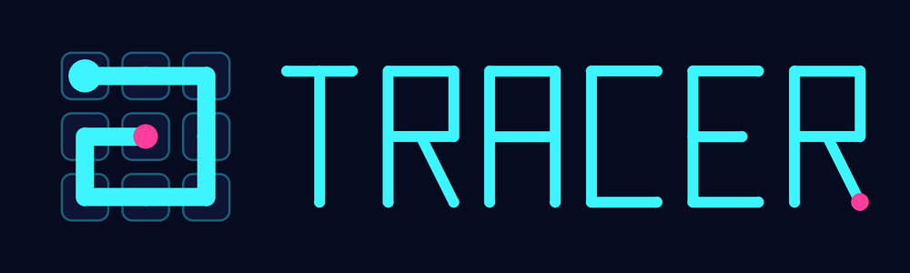
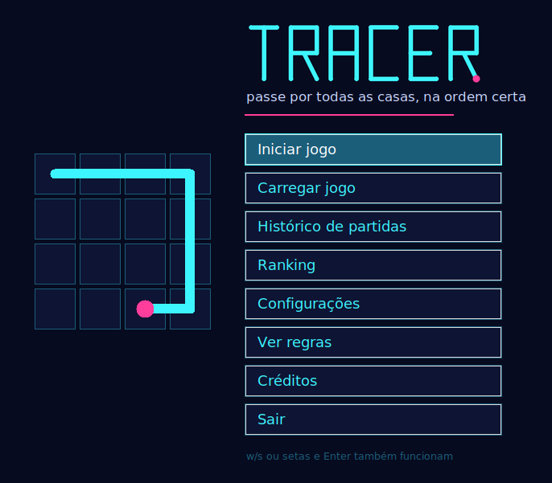
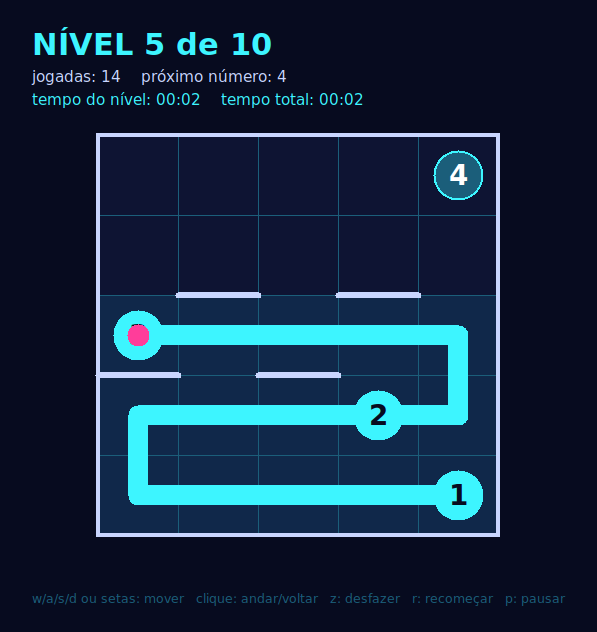
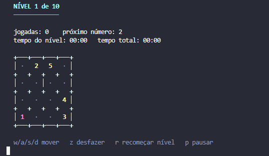

Jogo de lógica feito em Python como projeto final da disciplina de **Algoritmos Computacionais** (UERJ). Inspirado no jogo [Trace](https://wordle.global/ltg/trace). Pode ser jogado no terminal ou em janelas com interface gráfica.

> Versão 1.2: ranking dos melhores tempos, recorde de cada nível, logo e ícone.

## Como se joga

O objetivo é desenhar **uma única linha** que passe por **todas as casas** do tabuleiro, cada uma exatamente uma vez.

- A linha começa no número **1** e anda para cima, baixo, esquerda ou direita (nunca na diagonal).
- Os números devem ser visitados em **ordem crescente**: 1, 2, 3...
- A linha termina no **maior número**, depois de cobrir todas as casas.
- As bordas dentro do tabuleiro são **paredes** e não podem ser atravessadas.

São **10 níveis** de dificuldade crescente, de tabuleiros 4x4 até 7x7. Cada tabuleiro tem uma única solução. O jogo termina ao completar o décimo nível, e o tempo e as jogadas de cada nível ficam registrados no histórico e no ranking.

## Capturas de tela

<p align="center">
  
  
</p>
<p align="center"><em>Interface gráfica (<code>python tracer.py -gui</code>): menu principal e um nível em andamento</em></p>

<p align="center">
  
</p>
<p align="center"><em>O mesmo jogo no terminal (<code>python tracer.py</code>)</em></p>

## Novidades

### Versão 1.2
- **Ranking** com as 10 partidas mais rápidas entre as que completaram os 10 níveis começando do nível 1. Em caso de empate no tempo, fica na frente quem usou menos jogadas.
- **Recorde de cada nível**, com o melhor tempo já feito e as iniciais de quem fez.
- Ao vencer, o jogo mostra a colocação da partida no ranking.
- **Logo e ícone** do jogo, usados nas janelas e no menu principal gráfico.

### Versão 1.1
- **Interface gráfica com Tkinter**, ativada por argumentos de console. Cada parte do jogo pode ser gráfica ou de console de forma independente.
- Na janela do jogo, a linha pode ser movida pelo teclado ou clicando nas casas.

### Versão 1.0
- Jogo completo no console, com 10 níveis, menus, saves, save automático, histórico e registro de jogadas.

## Requisitos

- Python 3 (o Tkinter já vem junto na instalação padrão do Windows)
- **Linux:** a biblioteca `getch`, usada para ler as teclas no terminal, e o Tkinter, caso não venha com o seu Python:

```
pip install getch
sudo apt install python3-tk
```

## Como executar

```
git clone https://github.com/gustavosilvamartins/tracer.git
cd tracer
python tracer.py          # no terminal
python tracer.py -gui     # em janelas
```

Sem argumentos, o jogo abre no terminal. Para o terminal, use um terminal de verdade (Prompt de Comando, PowerShell ou o terminal integrado do VS Code); a leitura de teclas não funciona no IDLE nem na aba "Output" do VS Code.

### Argumentos de console

| Argumento | O que faz |
|---|---|
| `-novo` | Começa um jogo novo direto, sem passar pelo menu |
| `-carregar NOME` | Carrega o save `saves/NOME.save` direto |
| `-autosave NOME` | Usa `saves/NOME.save` como arquivo de save automático (padrão: `autosave`) |
| `-nivel N` | Define o nível inicial, de 1 a 10 (padrão: 1) |
| `-gui` | Todo o jogo em interface gráfica |
| `-gui-principal` | Só o menu principal (e as telas abertas por ele) em janela |
| `-gui-pause` | Só o menu de pausa em janela |
| `-gui-arquivos` | Só os menus de salvar e carregar em janela |
| `-gui-jogo` | Só o tabuleiro do jogo em janela |
| `-h` | Mostra a ajuda com todos os argumentos |

As opções de interface gráfica podem ser combinadas; `-gui` equivale a todas juntas. Exemplos:

```
python tracer.py -gui -novo
python tracer.py -gui-jogo -gui-pause
python tracer.py -carregar minha_partida
```

## Controles

| Tecla | No jogo | Nos menus |
|---|---|---|
| `w` `a` `s` `d` ou setas | Move a linha | `w`/`s` ou setas escolhem a opção |
| `Enter` | Continua para o próximo nível | Confirma a opção |
| `z` | Desfaz o último passo | |
| `r` | Recomeça o nível atual | |
| `p` | Abre o menu de pausa | |
| Clique (só na janela) | Clicar na casa vizinha avança; clicar na anterior desfaz | Clicar na opção |

No terminal do Linux, use `w` `a` `s` `d`; as setas funcionam no terminal do Windows e em todas as janelas.

## Menus

- **Menu principal:** iniciar jogo, carregar jogo, histórico de partidas, ranking, configurações, regras, créditos e sair.
- **Pausa:** voltar ao jogo, iniciar novo jogo, carregar, salvar, voltar ao menu principal e sair. O tempo parado na pausa não conta.
- **Arquivos:** lista os saves existentes, cria saves novos e pede confirmação antes de sobrescrever um save.
- **Configurações:** nível inicial e nome do arquivo de save automático.

Ao completar os 10 níveis, o jogo mostra o tempo de cada nível e o total, pede as suas iniciais de três letras, no estilo dos fliperamas antigos, e mostra a sua colocação no ranking.

## Arquivos gerados

As pastas abaixo são criadas automaticamente na primeira vez que o jogo precisa delas:

| Pasta | Conteúdo |
|---|---|
| `saves/` | Saves manuais e o save automático, feito depois de cada jogada |
| `historico/` | `historico.txt`, com uma linha por partida vencida (base do ranking) |
| `logs/` | `registro.log`, com todas as jogadas e erros (só é ampliado, nunca sobrescrito) |

## Estrutura do código

| Arquivo | Responsabilidade |
|---|---|
| `tracer.py` | Ponto de entrada: lê os argumentos com `argparse` e decide se abre o menu, começa um jogo ou carrega um save |
| `mecanica.py` | Regras do jogo: os 10 tabuleiros, o dicionário de estado, validação das jogadas e verificação de fim de nível e de jogo |
| `interface.py` | Interface de console: menus, desenho do tabuleiro, loop do jogo e escolha entre console e janela em cada parte |
| `gui.py` | Interface gráfica com Tkinter: janelas dos menus, do jogo, das telas de texto e da vitória |
| `arquivos.py` | Saves, save automático, histórico, ranking e registro de jogadas e erros |
| `imagens/` | Logo, ícone das janelas, título do menu principal e capturas de tela do README |

## Créditos

- **Autor:** Gustavo Martins
- **Disciplina:** Algoritmos Computacionais, UERJ
- **Inspiração:** Trace ([wordle.global](https://wordle.global/ltg/trace))
- Partes do código foram desenvolvidas com auxílio do Claude (Anthropic), como indicado nos comentários de cada arquivo.
